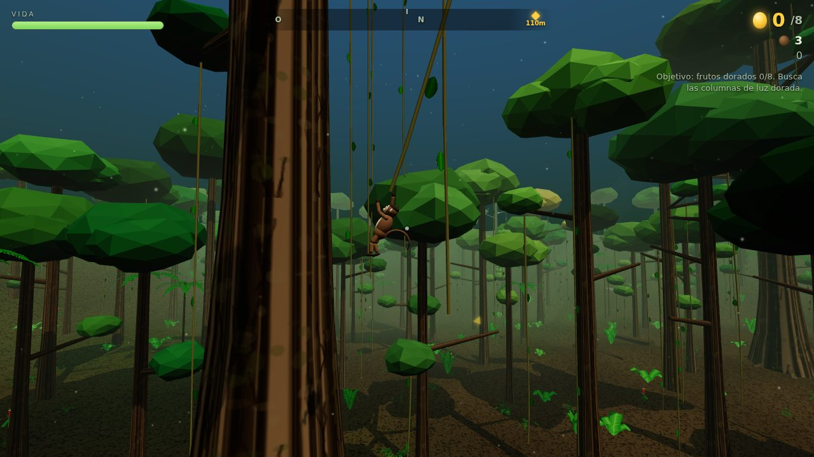
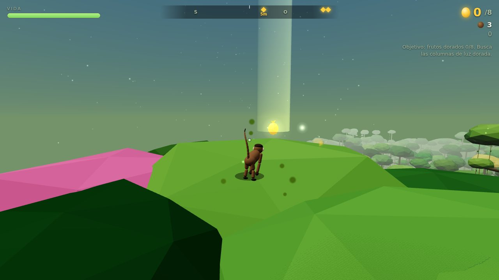
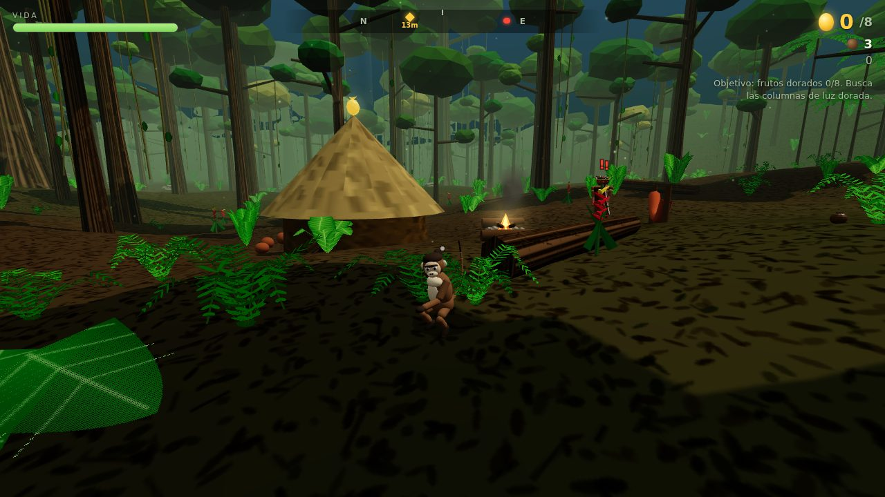

# Macaco: Fuga en la Amazonía

Juego 3D en el navegador. Eres un mono capuchino en la selva amazónica de Brasil:
te balanceas por lianas, trepas sumaúmas gigantes, corres por las copas y escapas
(o te enfrentas) a cazadores indígenas armados con arco. Las frutas amazónicas te
dan poderes.



| Sobre el dosel | Campamento de cazadores |
| --- | --- |
|  |  |

## Jugar ya (sin instalar nada)

Abre **`jugar.html`** con doble clic en Chrome, Edge o Firefox. Es un único archivo
autocontenido (motor, texturas y sonido generados por código): funciona sin
internet y sin servidor.

En móvil o tablet (en horizontal) aparecen controles táctiles.

## Objetivo

1. Reúne los **8 frutos dorados**. Se ven de lejos como **columnas de luz dorada**
   y la brújula superior marca el más cercano con su distancia. Están en sitios
   que exigen movilidad: cimas de sumaúmas gigantes, sobre el río (sólo
   alcanzables balanceándote), en tejados de malocas vigiladas, en palmeras altas…
2. Sube a la copa del **Gran Sumaúma** (el árbol ancestral del centro del mapa,
   marcado en verde en la brújula) para ser libre.

Cada fruto dorado que coges atrae refuerzos de cazadores. Si tu vida llega a 0, te atrapan.

## Controles

| Acción | Teclado / ratón | Táctil |
| --- | --- | --- |
| Mover | `W` `A` `S` `D` | Joystick (al máximo corres) |
| Cámara | Ratón · flechas · rueda = zoom | Arrastrar a la derecha |
| Saltar / soltar liana con impulso | `Espacio` (mantén para saltar más) | Saltar |
| Correr / subir por la liana | `Shift` | ▲ Subir |
| Bajar por la liana / golpe al suelo (en el aire) | `C` | ▼ Bajar |
| Trepar a un tronco / soltarse | `E` (o saltar contra el tronco) | Trepar |
| Golpe (combo de 3) / patada voladora (en el aire) | Clic izq. / `J` | Golpe |
| Lanzar castaña al punto de mira | Clic der. / `K` | Lanzar |
| Esquivar | `Q` | Esquivar |
| Pausa (sensibilidad, invertir eje, sonido) | `Esc` / `P` | ❚❚ |

Si el navegador no permite capturar el ratón (por ejemplo dentro de un iframe), la
cámara pasa a girarse manteniendo el clic derecho y arrastrando.

## Movilidad

Lo más importante del juego es moverse por la selva en 3D, así que la física es propia:

- **Lianas**: cada liana es una cuerda simulada (Verlet) que se mece con el viento.
  Al agarrarla, el mono es un **péndulo con restricción de cuerda**: conserva la
  inercia con la que llegó, se impulsa (bombeo) con WASD en el plano tangente,
  puede **subir y bajar por la cuerda** (al acortarla gira más rápido), y la cuerda
  sólo resiste el estiramiento: si pasas por encima del anclaje, caes libre hasta
  que se tensa. Soltar al final del arco da altura; en el punto bajo, distancia.
  Encadenar lianas sin tocar el suelo suma combo.
- **Troncos**: te agarras saltando contra ellos; subes, bajas y rodeas el tronco,
  saltas desde él hacia donde mires (sirve para rebotar entre troncos) y al llegar
  arriba subes a la copa.
- **Copas y ramas**: las copas de los árboles, las ramas y los troncos caídos son
  superficies transitables. Puedes correr por encima del dosel.
- **Suelo**: aceleración e inercia, salto variable, *coyote time* y *buffer* de salto,
  esprint, esquiva con invulnerabilidad breve. Caer desde muy alto hace daño.
- **Agua**: el río se cruza nadando (lento y vulnerable) o balanceándose por las
  lianas que cuelgan de los árboles de la orilla.
- **Animación procedural**: el mono tiene esqueleto propio y se anima por código
  (galope cuadrúpedo, cuelgue con la cola enroscada, trepar alternando brazos,
  voltereta en el golpe al suelo…).

## Cazadores

Su IA tiene estados de **patrulla → investigación → combate → búsqueda**:

- **Vista** con cono de visión, alcance y línea de visión real: los troncos y el
  terreno tapan; el **follaje atenúa** (en lo alto de una copa casi no te ven).
  Un indicador `?` amarillo muestra que alguien está sospechando.
- **Oído**: correr por el suelo, aterrizar fuerte o pelear hace ruido. Una castaña
  lanzada lejos sirve de **distracción**.
- **Disparo**: tensan el arco (≈1 s, con aviso rojo en pantalla indicando de dónde
  viene) y disparan con **trayectoria balística y anticipación** de tu movimiento.
  Quedarte quieto es peligroso; cambiar de dirección o romper la línea de visión
  te salva. Sólo unos pocos pueden apuntar a la vez (más según la dificultad).
- Se avisan entre ellos, se acercan o se alejan para mantener distancia de tiro y,
  si te pones encima, te golpean con el arco.
- Los enfrentamientos no son letales: los cazadores quedan **noqueados** un rato y después desaparecen de la zona.

## Frutas

| Fruta | Poder | Duración |
| --- | --- | --- |
| Açaí | **Fuerza**: los golpes noquean de un impacto, el golpe al suelo es enorme | 18 s |
| Guaraná | **Energía**: más velocidad, salto, balanceo y trepada | 20 s |
| Cupuaçu | **Escudo**: las flechas rebotan | 15 s |
| Maracujá | **Camuflaje**: los cazadores no te ven | 16 s |
| Camu-camu | **Vitalidad**: +40 de vida y regeneración | 10 s |
| Jabuticaba | **Instinto**: el tiempo se ralentiza para cazadores y flechas | 9 s |

Además: **plátanos** (curan), **castañas** (munición; también las sueltan los
cazadores noqueados) y regeneración lenta de vida si pasas un rato sin recibir daño.

## Desarrollo

Requiere Node 18+.

```bash
cd juegos/mono-amazonas
npm install
npm run dev        # servidor de desarrollo con recarga (http://localhost:5173)
npm run dev -- --host  # igual, accesible desde el móvil en la misma red
npm run typecheck  # comprobación de tipos
npm run build      # compila y regenera jugar.html (archivo único)
```

Todos los parámetros de juego (velocidades, gravedad, fuerza del bombeo, daño,
dificultades, duración de poderes, puntuación…) están en `src/config.ts`.

### Arquitectura

Motor: [three.js](https://threejs.org) para el render; física, IA, animación,
audio y generación del mundo son propios. Sin assets externos: texturas en canvas,
modelos procedurales y sonido sintetizado con WebAudio.

```
src/
  main.ts                    arranque
  config.ts                  parámetros de juego y dificultades
  game/game.ts               bucle, estados (menú/juego/pausa/fin), objetivos, tutorial
  game/context.ts            referencias compartidas entre sistemas
  core/                      matemáticas, ruido simplex, RNG con semilla, rejilla
                             espacial, entrada (teclado/ratón/táctil), audio procedural,
                             fusión de piezas de personajes
  world/                     terreno y río, bosque (sumaúmas, dosel, palmeras de açaí,
                             ramas), lianas (Verlet), vegetación instanciada,
                             campamentos, cielo/niebla/sol/haces de luz, consultas físicas
  player/                    controlador del mono (máquina de estados con subpasos a 120 Hz),
                             modelo y animación procedural, poderes
  enemies/                   IA de cazadores, modelo animado con arco, gestor de oleadas
  combat/projectiles.ts      flechas balísticas y castañas
  items/                     frutas: modelos y colocación inteligente por el mapa
  camera/                    cámara en tercera persona con colisión y FOV dinámico
  fx/particles.ts            partículas en GPU
  ui/                        HUD (brújula, avisos de amenaza, poderes) y menús
scripts/empaquetar.mjs       genera jugar.html incrustando JS y CSS
```

Rendimiento: el bosque usa *instancing* troceado por zonas para el *frustum
culling*, los personajes fusionan sus piezas por hueso, y las sombras del sol sólo
cubren el entorno del jugador. Si va lento, baja la **Calidad** en el menú (Media
reduce la resolución interna; Baja además desactiva las sombras).

## Limitaciones conocidas

- Pensado para ordenador con teclado y ratón; el control táctil es funcional pero más básico.
- No hay guardado de partida (sólo se recuerda el récord y los ajustes).
- El rendimiento depende de la GPU; en equipos modestos usa la calidad Media o Baja.
